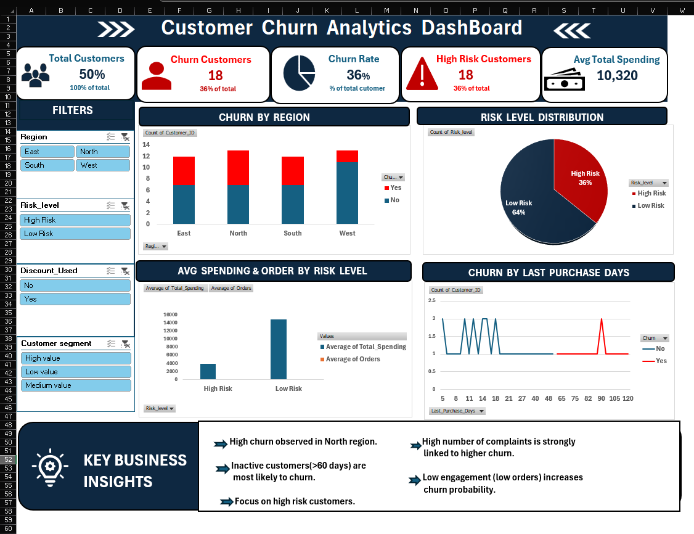

# 📊 Customer Churn Analysis Dashboard (Excel)

## 📌 Problem Statement  
Customer churn is a major challenge for businesses as losing customers directly impacts revenue. This project focuses on analyzing customer behavior to identify churn patterns and high-risk customers.

## 🎯 Objective  
- Identify customers likely to churn  
- Analyze factors influencing churn  
- Provide insights for better decision-making  

## 📊 Dashboard Preview  

## 🛠️ Tools Used  
- Microsoft Excel  
- Pivot Tables  
- Slicers  
- Data Visualization
- 

## 🔄 Project Workflow  
1. Data Cleaning and Preparation  
2. Feature Engineering (Churn Score, Risk Level)  
3. KPI Creation (Churn Rate, High Risk Customers)  
4. Dashboard Design with charts and slicers  

## 📈 Key Insights  
- Customers inactive for more than 60 days are most likely to churn  
- Higher number of complaints increases churn probability  
- Low engagement customers have higher churn risk  
- Discounts are not significantly reducing churn  

## 💡 Business Recommendations  
- Focus on high-risk customers with personalized offers  
- Improve customer service to reduce complaints  
- Increase engagement for inactive users  
- Use targeted retention strategies  

## 🚀 Future Improvements  
- Build Power BI dashboard  
- Add machine learning model for churn prediction  
- Automate data updates  
